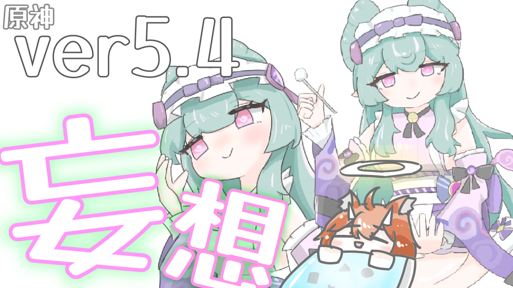
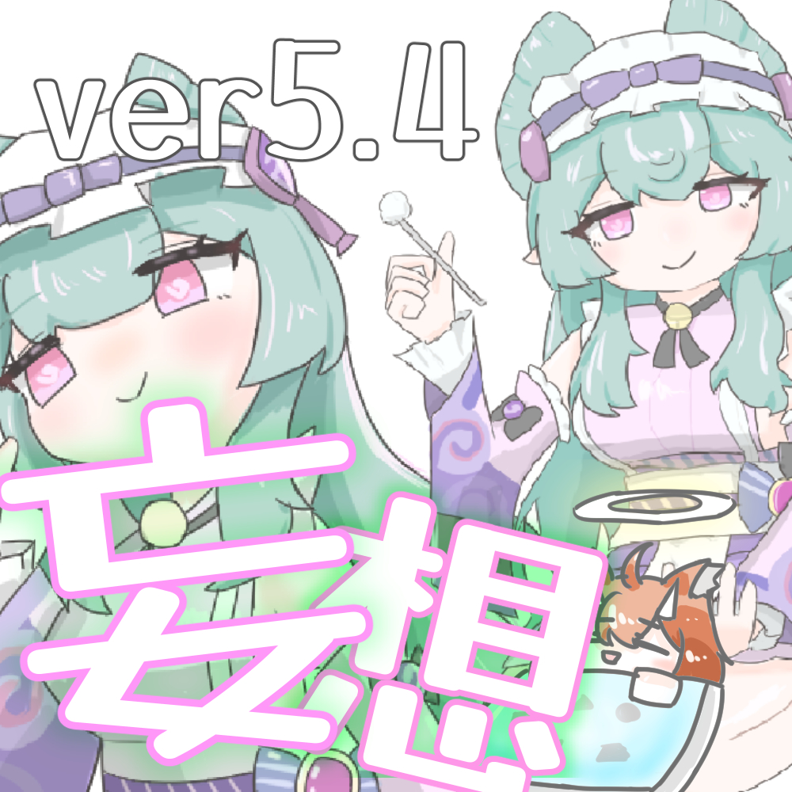
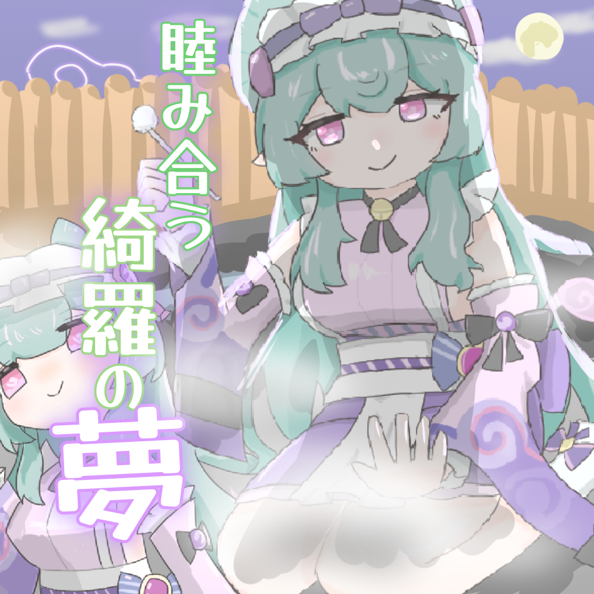
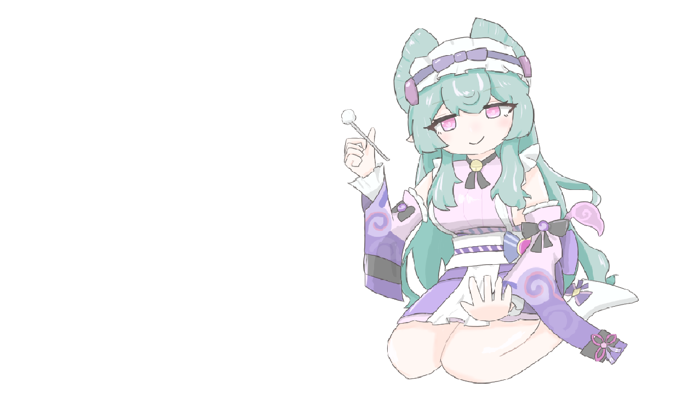
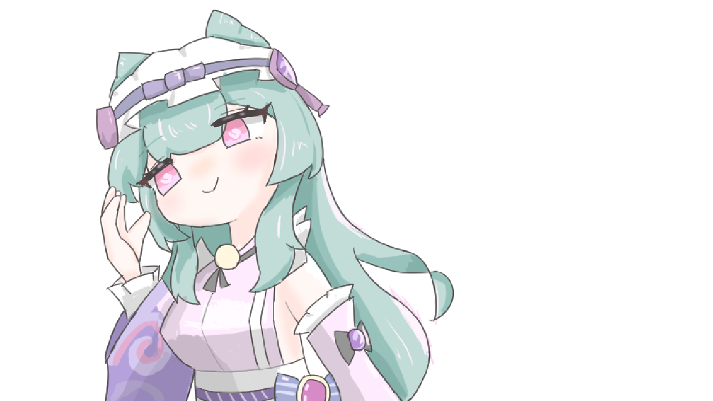

+++
date = '2025-01-18T10:38:52+09:00'
draft = false
title = '原神ver5.4予告番組妄想同時視聴！！ #27'
audioUrl = 'output.opus'
audioLength = '1:05:47'
podcastImage = 'ハルシネラジオ原神ver5_4妄想podcastサムネイル.jpg'
description = '''

↓ポッドキャスト作成に当たって作ったイラストとかおまけをおいています！

https://kamocast.pages.dev/hallucination-radio/episode27/

頼んだぞ・・・miHoYo・・・

【動画内で紹介した動画】
・シトラリアニメ,    • 【原神】キャラアニメ——「瓶の中の願い」  
・【原神】とうとう魔神任務5章5幕(灼烈の反魂の詩)やるよ！, https://youtube.com/live/7PBsw49nIn0

【参考にしたサイト】
・散り行く心の暗雲、夢に見た月明かり, https://www.hoyolab.com/article/36178015
・獏枕（ばくまくら, https://ouchidehaiku.com/contents/357406
・MapleStory Worlds, https://prtimes.jp/main/html/rd/p/000...

【SNS】

🪻Pleroma(pleniya):https://plrm.komaniya.work/users/kamo...

🐦X(Twitter):  / kamosika179   

🐘Mastodon(fedibird):https://fedibird.com/@kamosika

Xは基本的に動画投稿などの告知の際にみています！なので投稿が少なかったり、返事を返すのが遅くなったりします！(週1とか…？)
依存気味だったので見る頻度を減らしています…

今はPleromaの方をよく見ていて色々喋ったりしています！
Mastodon、Misskeyなどのアカウントがあればフォローしたりリプライを送ることができるので、興味持ってくれたならフォローしてもらえると嬉しいです！
投稿をみるだけなら、アカウントなくてもみれますし、rssも取得できたと思うので都合に合わせてもらえれば！

【使用している素材】
BGM
A Carefree Village Life,https://dova-s.jp/bgm/play21541.html

SE等
・効果音ラボ,https://soundeffect-lab.info/

検索用の情報！

原神　Genshin ver5.4 予告番組 妄想 夢見月瑞希　mizuki

'''
+++

検索用の情報の入れ方とか・・・そもそもSNSの情報とかが毎エピソードの概要についているのも同なのかなぁ・・・と思ったり・・・あ！あと！！このウェブページへ辿るためのリンクとかも貼りたいよねぇ・・・けどなんか・・・spotifyってurl書いてもリンクになっていないよね？？あ、スマホからならリンクになっているのね！

## とりあえずおまけ

### YouTube版

[【ハルシネラジオ】原神ver5.4予告番組妄想同時視聴！！ #27](https://youtu.be/iIIndGsE65U)

### サムネイル

↑なんか音声作品風のサムネイルを作りたくなったので作ったもの！！！お願いmiHoYo！！！

### 夢見月瑞希イラスト！



まーーーじで描けない！！！非常に描けない描けないと悩みまくりながら描いていた！！

そもそも普段お絵描きするのって簡単なちびキャラっぽいものだったりするので・・・今回は等身高めでしかも「指」！を描いているんですね！珍しく！！！

なので本当に描けない・・・ずっと言っているけど模写とかしたりして勉強する時間を取りたいけど・・・うーんやらないんだろうなぁ～！！

見下ろし瑞希イラストを描いてみて、普段描かないようなアングルを描くと完成した時にテンション上がるかも！とか思ったりしました。（描いている最中は本当に何もわからない・・・）

毎度毎度イラストを描き終わってから感じるのですが・・・もっと解像度が高いキャンバスを作ってお絵描きをしたら・・・？なんか拡大とかに「う。。。ボケちゃっている・・・」となるので・・・

### おわり

ということでおまけでした～ありがとうございます！！

