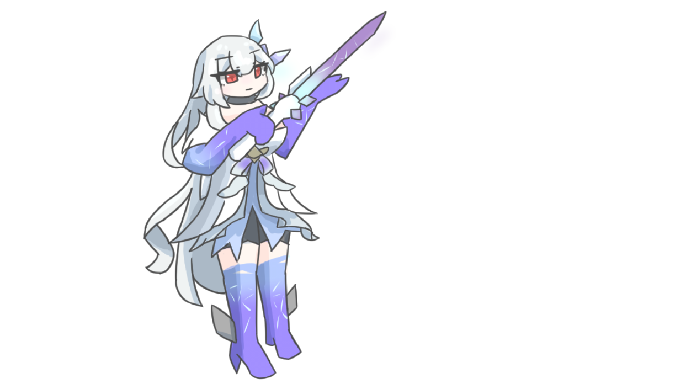

+++
date = '2025-05-24T08:25:51+09:00'
draft = false
title = '原神ver5.7の妄想しよう！！！スカークさん… #31【ハルシネラジオ】'
audioUrl = 'ハルシネラジオ原神ver5_7妄想同時視聴.opus'
audioLength = '1:07:53'
podcastImage = '原神ver5-7妄想同時視聴サムネイルポッドキャスト用.jpg'
tags = ['原神','スカーク','ダリア','心海']
description = '''

↓動画はこちら！

https://www.youtube.com/watch?v=6wWpLkP1n8E

↓配信ページ、お絵描きしたものとか置いています。

https://kamocast.forrexlapis.win/hallucination-radio/episode31/

※ガンガンにクーラーと扇風機を動かすことで発生するノイズを除去した結果「ごそごそｼﾞｭﾜｼﾞｭﾜ」みたいな音が発生しています・・・そこはちょっと悔しいな・・・

あと！実はちょっと音声を加工してみて、「低音を削って、高温を上げ気味にしてみた！！」
自分で聞き直している限りでは、「加工前より聞きやすくなった気がする！」どうかな！？

【SNS】

🪻Pleroma(pleniya):https://plrm.komaniya.work/users/kamosika

🐦X(Twitter):https://twitter.com/kamosika179 

🐘Mastodon(fedibird):https://fedibird.com/@kamosika

Xは基本的に動画投稿などの告知の際にみています！なので投稿が少なかったり、返事を返すのが遅くなったりします！(週1とか…？)
依存気味だったので見る頻度を減らしています…

今はPleromaの方をよく見ていて色々喋ったりしています！
Mastodon、Misskeyなどのアカウントがあればフォローしたりリプライを送ることができるので、興味持ってくれたならフォローしてもらえると嬉しいです！
投稿をみるだけなら、アカウントなくてもみれますし、rssも取得できたと思うので都合に合わせてもらえれば！

【使用している素材】
BGM
A_Carefree_Village_Life

'''
+++

## お絵描きしたもの！

### サムネイル

**PC用**

**ポッドキャスト用**

### お絵描き！

本当は「座っている感じ」で書きたかったけど立体感がなさ過ぎて「立っている」感じになった・・・

これはこれでよいきもするけど、うーむ・・・

目の中の🔶描きたかったけど・・・どうも自分、「目」の書き方がずーーっとわからない！！なんか普段とは違う「目の感じ」を描いている途中にものすごい違和感を感じちゃって苦手なのよね・・・

諦め・・・諦めのスカーク！！指とかさ・・・描けるようになりたい

かわいいね

### イラストタイムラプス


