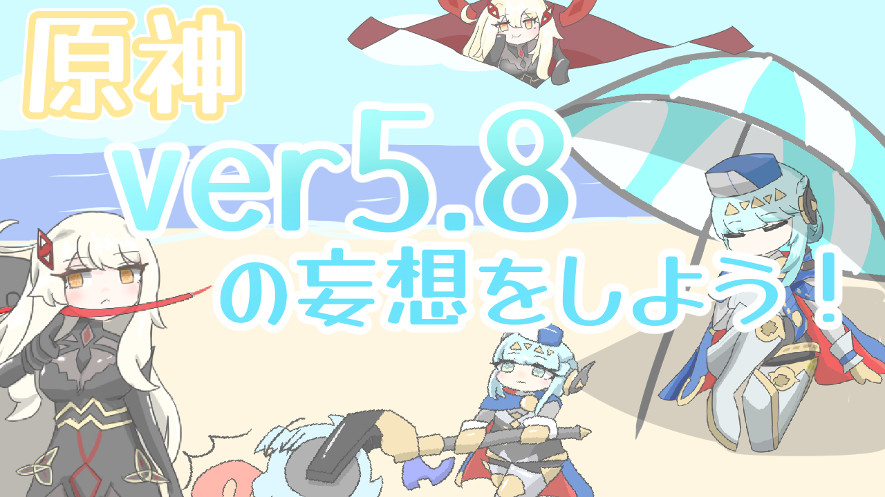
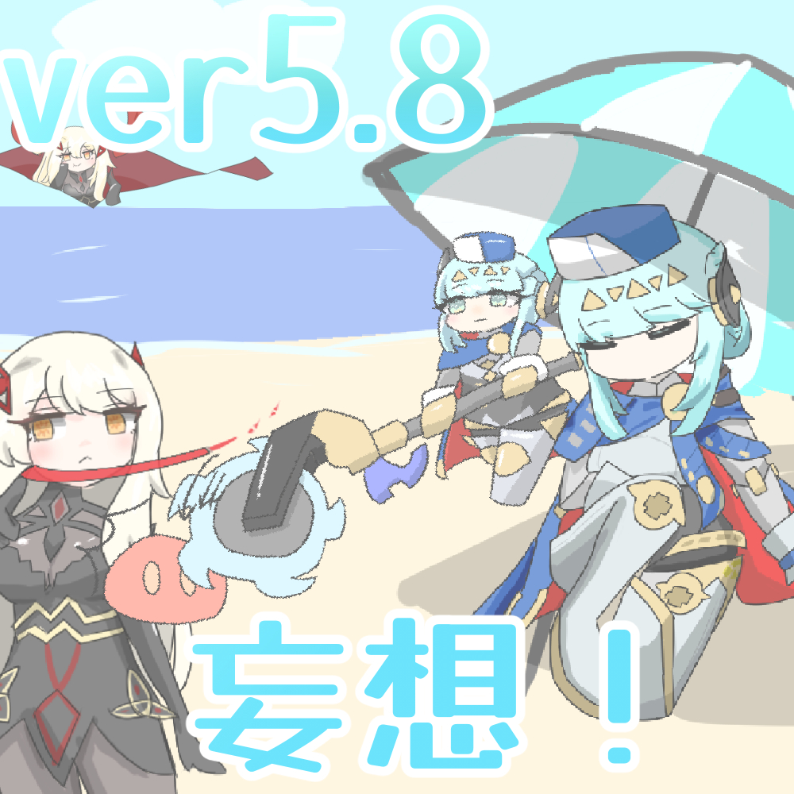
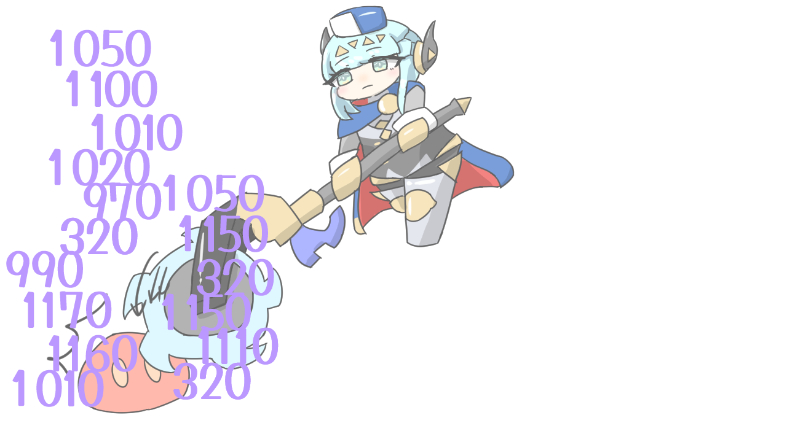
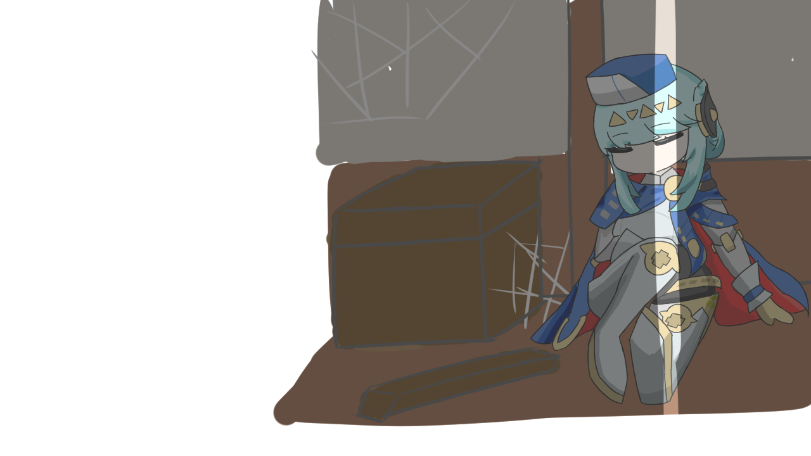
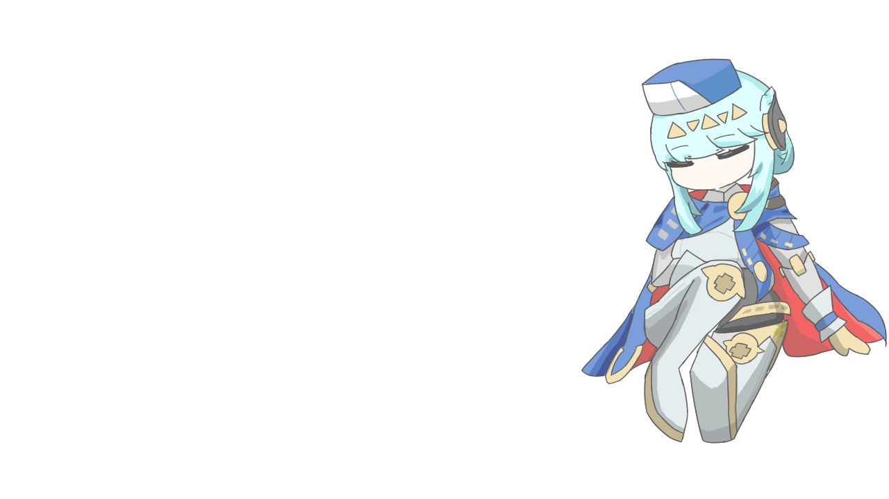
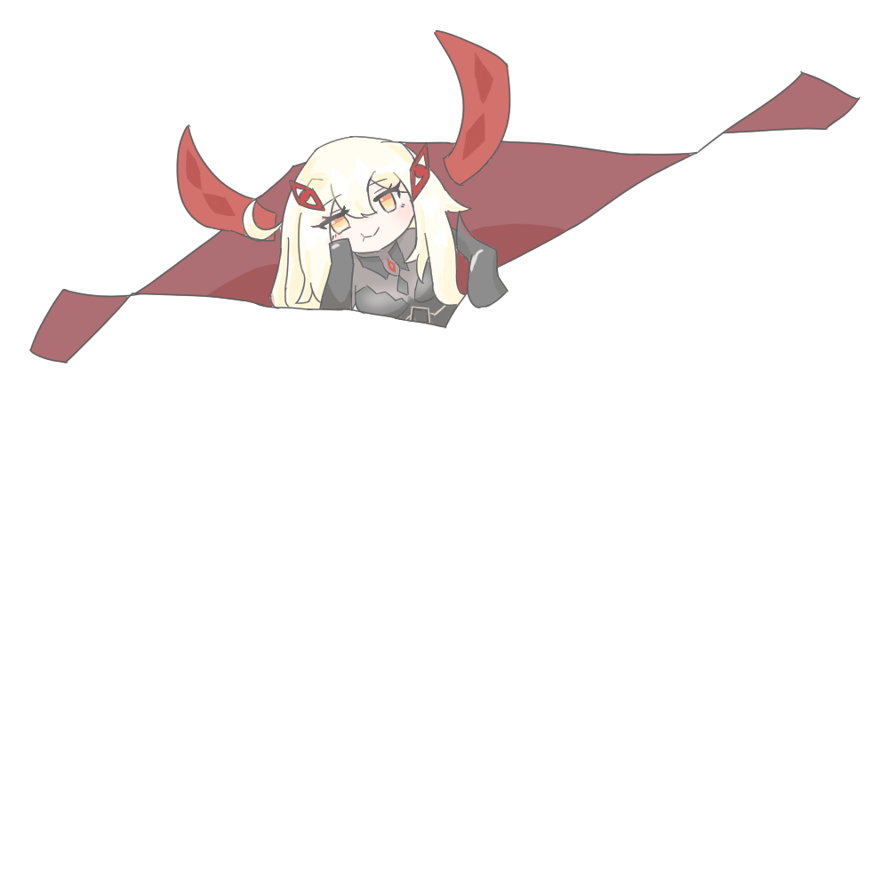
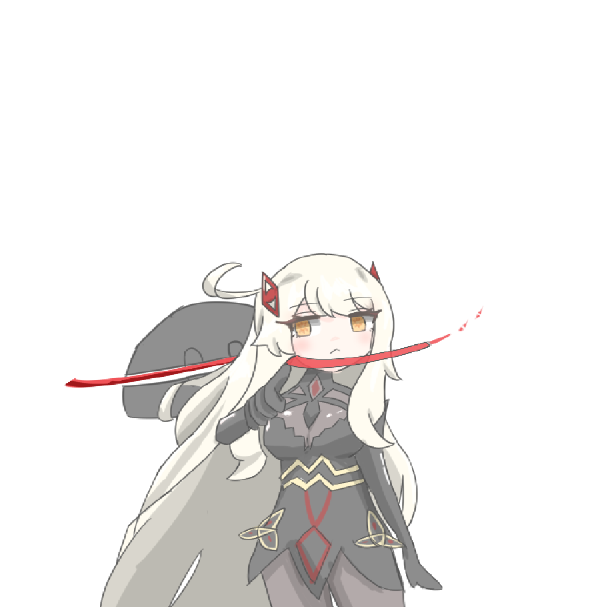

+++
date = '2025-07-13T10:49:10+09:00'
draft = false
title = '原神ver5.8の妄想しよう！！！と思っていたけど執政の情報が出てきてしまったんだなぁ・・・ #32'
audioUrl = 'output_audio_opus_32bitrate.opus'
audioLength = '1:08:38'
podcastImage = '原神ver5_8サムネイルポッドキャスト用.jpg'
tags = ['原神','イネファ','ロノヴァ']
description = '''

↓動画はこちら！

https://youtu.be/iU5G5ZNHtnw

↓配信ページ、お絵描きしたものとか置いています。

https://kamocast.forrexlapis.win/hallucination-radio/episode32/

パソコンのファンをだいぶ前に増やしたんだけど・・・ずっとカラカラなっていて・・・それをノイズキャンセリングで撮り切れていない・・・すみません・・・

めんどくさがらずにさっさとどうにかしたいね・・・

【SNS】

🪻Pleroma(pleniya):https://plrm.komaniya.work/users/kamosika

🐦X(Twitter):https://twitter.com/kamosika179 

🐘Mastodon(fedibird):https://fedibird.com/@kamosika

Xは基本的に動画投稿などの告知の際にみています！なので投稿が少なかったり、返事を返すのが遅くなったりします！(週1とか…？)
依存気味だったので見る頻度を減らしています…

今はPleromaの方をよく見ていて色々喋ったりしています！
Mastodon、Misskeyなどのアカウントがあればフォローしたりリプライを送ることができるので、興味持ってくれたならフォローしてもらえると嬉しいです！
投稿をみるだけなら、アカウントなくてもみれますし、rssも取得できたと思うので都合に合わせてもらえれば！

【使用しているソフト】
動画編集
・ゆっくりMovieMaker4
・Aviutl

お絵描き
・CLIPSTUDIO

録画/配信
・OBS

【使用している素材】
BGM
A_Carefree_Village_Life
'''
+++

## お絵描きしたもの！

### サムネイル

**PC用**

**ポッドキャスト用**

サムネイルを作るときに、

「ちょっと夏っぽい雰囲気にしたいな文字とかさ」

「なんか背景いい感じに描けないかなぁ」

となり・・・

文字はちょっと「夏　文字」みたいな感じで検索して、下のサイトを見つけました。

https://hanasaqutto.com/3349/game_ui_design/how-to-make-game-ui-material-late-06-2020/

たまたま見つけたのですが、夏っぽい文字とか以外にもデザインに関してすごい参考になりそうな情報がたくさん載っていそうで「すげぇ！」となっています！とてもラッキー！！

あと、ちょうど「座っているイネファ」のイラストがあったので、「涼んでいるイネファとかにしちゃえばめっちゃ夏っぽいかも！！！」とひらめいてパパっと背景つけました。いい感じ！！

### イネファ！



最近はちょっといつもと違うというか・・・ちょっと等身が高い感じのイラストを描くようにしたくて・・・ちびっとしたのと、ちょっと等身高くてポーズがついているものを描いてみました。

描いてから気づいたのですが、なんか今回のちびきゃら、いつも以上にすごいGimnaeng味を感じるになっていました

https://www.youtube.com/watch?v=nEGEXvXx3ho

顔が横に広い感じになったからでしょうか？

### ロノヴァ！



水曜・・・急に情報が公開されて**描かねば・・・！！！** となったもの

そしてもう片方の「打ち首ロノヴァ」に関しては、休日に描きたいな～と思いつつも描けずに「収録直前に」描き始めたものです。

この二つのイラストを描いていて、ものすごい・・・なんていうんだろう・・・

イラストを描くうえでのスピードが上がっている？気軽にお絵描きができるようになっているなぁと感じました。

すごい悩みつつだけど・・・おててが描けるように頑張ったりしていたり・・・これからも成長、変化していけるとイイですねぇ～～

