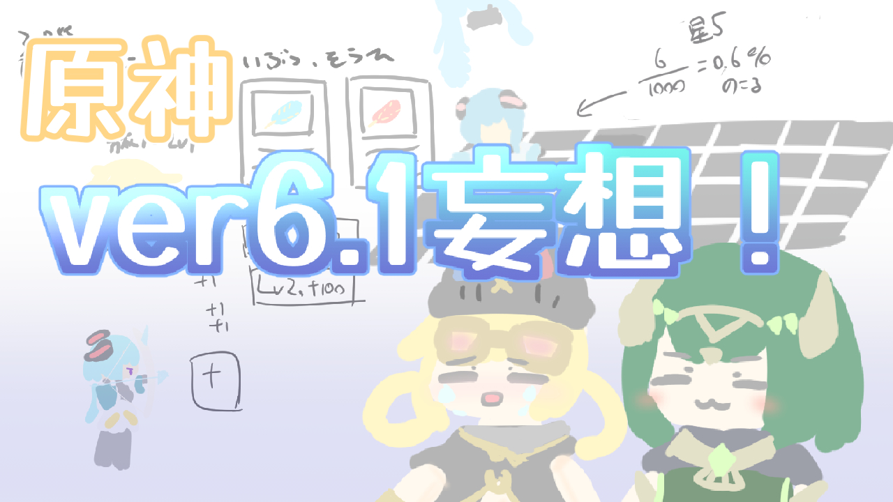
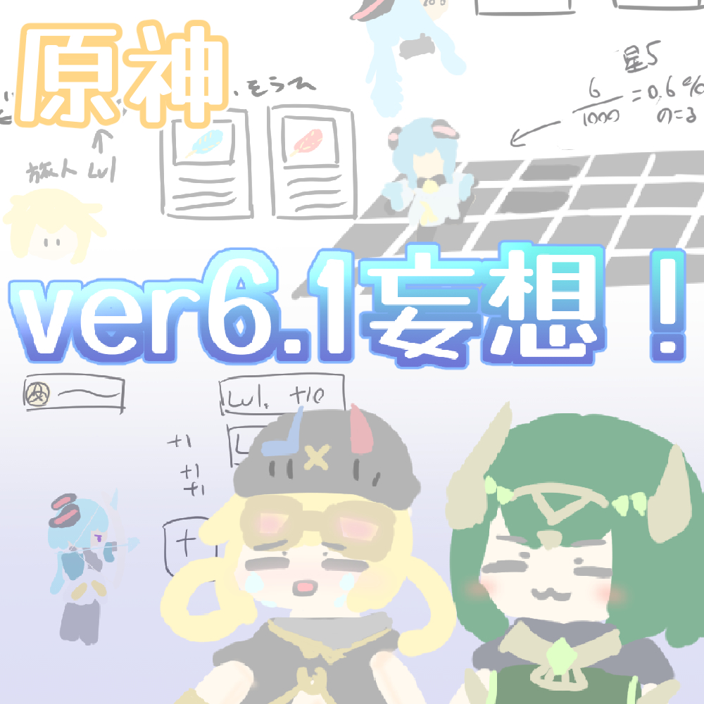
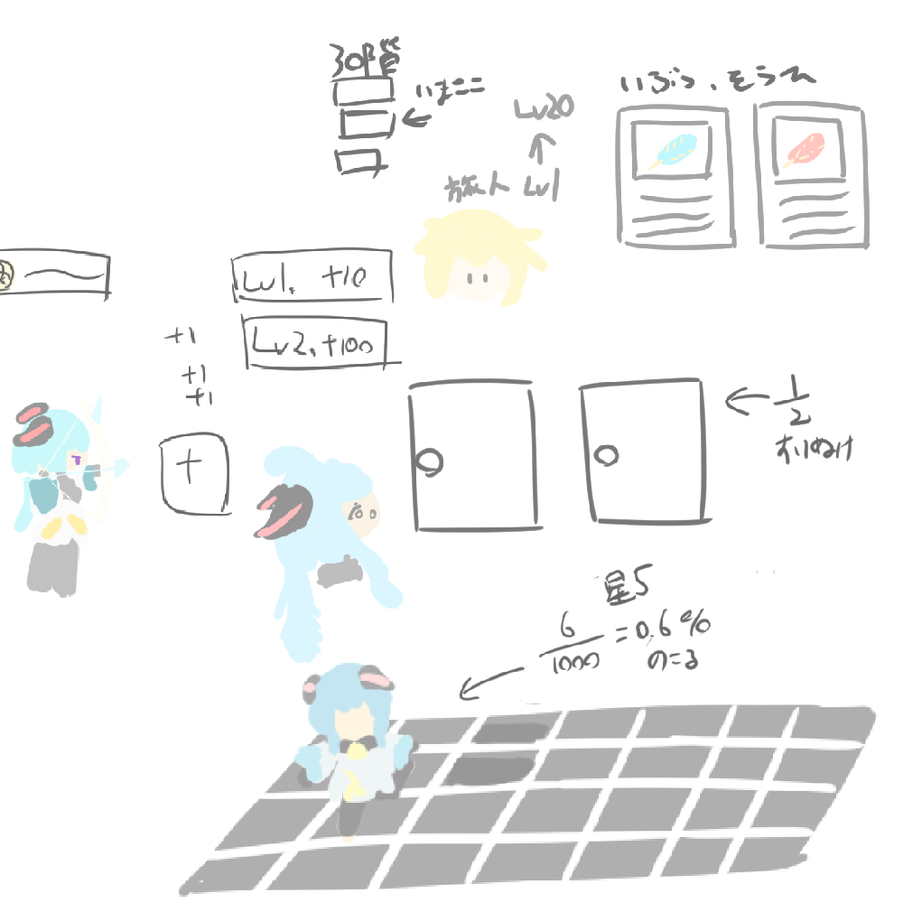

+++
date = '2025-10-05T19:46:10+09:00'
draft = false
title = '原神ver6.1！LunaⅡ！！の妄想しよう！！！星々の幻境のアイディアを考えよう！！！！#34'
audioUrl = 'output_audio.opus'
audioLength = '0:56:16'
podcastImage = '原神ver6-1妄想サムネイルポッドキャスト用.jpg'
tags = ['原神','LunaⅡ','星々の幻境','ネフェル']
description = '''

↓動画はこちら！

https://youtu.be/YA2JejDhrM4

https://prtb.komaniya.work/w/22yR8icSZzZ8s5981ayRvn

↓配信ページ、お絵描きしたものとか置いています。

https://kamocast.forrexlapis.win/hallucination-radio/episode34/

星々の幻境・・・どうなっちまうんだ・・・！！！

ナド・クライBGM本当に良い！！！

【使用させていただいたBGM等！】
・A_Carefree_Village_Life
・[追慕回廊](https://dova-s.jp/bgm/play20791.html) :龍崎一
・[効果音ラボ](https://soundeffect-lab.info/)

【SNS】

🪻Pleroma(pleniya):https://plrm.komaniya.work/users/kamosika

🐦X(Twitter):https://twitter.com/kamosika179 

🐘Mastodon(fedibird):https://fedibird.com/@kamosika

Xは基本的に動画投稿などの告知の際にみています！なので投稿が少なかったり、返事を返すのが遅くなったりします！(週1とか…？)
依存気味だったので見る頻度を減らしています…

今はPleromaの方をよく見ていて色々喋ったりしています！
Mastodon、Misskeyなどのアカウントがあればフォローしたりリプライを送ることができるので、興味持ってくれたならフォローしてもらえると嬉しいです！
投稿をみるだけなら、アカウントなくてもみれますし、rssも取得できたと思うので都合に合わせてもらえれば！

'''
+++

星々の幻境・・・どうなっちまうんだ・・・！！！

ナド・クライBGM本当に良い！！！

## お絵描きしたもの！

### サムネイル

**PC用**

**ポッドキャスト用**

### 星々の幻境コンセプトアート

今回全体的にテキトーに直前でぽわーっと描いていていました。時間ないしぃ・・・という感じで！！

とりあえず主線とか書かずに色で形を作って描いてみたのですが**いい感じかも！！** と思いました！！楽だし、可愛げがある気がするし！！

### ヤフォダとネフェル

ヤフォダも幸せになってほしいね・・・；；

### タイムラプス



